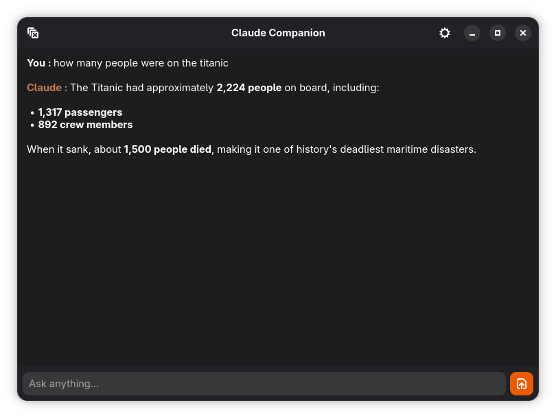

# Claude Companion (fully developped by Claude)

A small Claude (Anthropic API) chat window integrated into GNOME Shell search.
Type your question in the Shell search bar, hit Enter, and the answer appears
in a tiny GTK4 window — meant as a replacement for the Claude Desktop Quick
Window, which doesn't work under GNOME Wayland.




## Features

- GNOME Shell search provider (`org.gnome.Shell.SearchProvider2`)
- Streaming responses with Markdown rendering (bold, italic, code, lists, headings…)
- Model picker (Haiku 4.5 / Sonnet 4.6 / Opus 4.7)
- Light / dark / automatic theme
- UI in English, French, German, Spanish, Italian (and Claude's reply language follows)
- Configurable system prompt and `max_tokens`
- API key stored in the GNOME keyring via libsecret

## Requirements

- A recent Linux distribution with GNOME 47+ (tested on Fedora 44)
- `flatpak` and `flatpak-builder`
- GNOME 50 runtime (installed automatically by `flatpak-builder` if missing)
- An Anthropic API key (pasted on first launch)

On Fedora:

```sh
sudo dnf install flatpak flatpak-builder
flatpak remote-add --if-not-exists --user flathub https://dl.flathub.org/repo/flathub.flatpakrepo
```

## Installation

```sh
git clone https://github.com/vincent1903/claude-companion.git
cd claude-companion
flatpak-builder --user --install --force-clean build-dir org.little_home.ClaudeCompanion.yml
```

The build downloads `anthropic` and `markdown-it-py` from PyPI at build time
(the `--share=network` flag is enabled in the manifest for the Python module).
Allow ~2 minutes on the first build.

## Enabling the search provider

Flatpak disables every exported search provider by default. Once installed:

1. Log out and back in (so `gnome-shell` rescans the `.search-provider.ini`)
2. **Settings → Search** → enable "Claude Companion"

## First launch

- Start the app (`flatpak run org.little_home.ClaudeCompanion` or via the
  application grid)
- Paste your `sk-ant-…` key in the dialog that appears: it is stored in the
  GNOME keyring (never in plaintext on disk)
- Open Preferences to choose theme / language / model / system prompt

## Using it from search

- Open the GNOME overview (Super key, then type)
- Type your question — it appears with the title "Ask Claude: …"
- `Enter` opens the window and sends the prompt directly

## Architecture

```
src/
├── window.py            # Main GTK4 window, preferences, chat
├── provider.py          # D-Bus SearchProvider2 service
├── api.py               # Anthropic wrapper (streaming, system prompt, language)
├── keyring.py           # Read/write API key via libsecret
├── markdown_render.py   # Markdown → Gtk.TextTag rendering
├── config.py            # JSON config (~/.config/claude-companion/)
└── i18n.py              # gettext setup (dynamic locale)
bin/                     # Shell wrappers (Flatpak entry points)
data/                    # .desktop, .metainfo.xml, .service, .ini, icon
po/                      # Translations (.po) + template (.pot)
```

## Uninstall

```sh
flatpak uninstall --user --delete-data org.little_home.ClaudeCompanion
```

## License

MIT — see [LICENSE](LICENSE).
